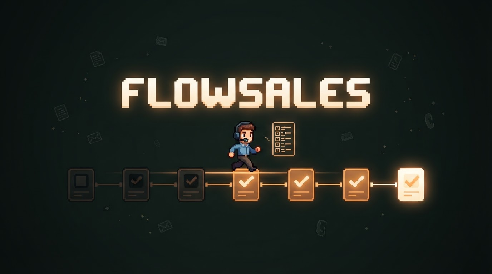
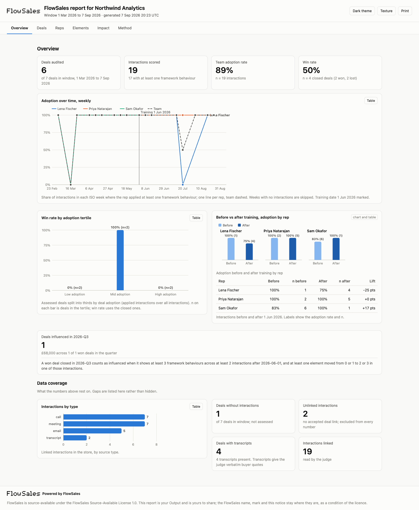
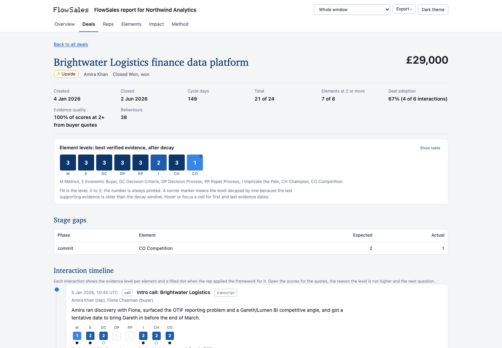

<p align="center">
  
</p>

# FlowSales

> Sales methodology as a system of record, not a training you attended.

FlowSales is a Claude Code plugin that reads your own CRM and meeting transcripts, scores every call, email, meeting and note against MEDDPICC with the buyer's exact words as evidence, measures how much each rep actually applies the framework week by week, ties adoption to won and lost deals, and briefs every rep each morning. It runs inside your Claude Code, on your machine, read-only. Nothing leaves except the model calls your session already makes.

Six commands. One loop. Source-available.

## The loop

```
  /flow-sales:setup     connect HubSpot, Granola, a transcripts folder or a CSV export
        |               pick the framework, the window, the reps, the training date
        |
  /flow-sales:link      build the record of which calls and meetings belong to which deal
        |               (CRM associations, attendee emails, company domains, times, titles;
        |               you resolve the ambiguous ones once, it remembers)
        |
  /flow-sales:audit     score every interaction on every deal in the window with quoted
        |               evidence, roll up to deals, reps, elements and team, build the report
        |
  /flow-sales:standup   one rep, one morning: say where each live deal stands, then see the
        |               evidence, the next framework move per deal, one thing to practise
        |
  /flow-sales:retro     one rep, one week: adoption vs last week and the team, deals moved,
        |               wins and losses explained by element, the focus for next week
        |
  /flow-sales:impact    one quarter: adoption before and after training, win rate by adoption,
                        the won deals that followed framework actions, the rule beside each number
```

Run `audit` once for the historical benchmark, then `standup` daily and `retro` weekly. `impact` is the slide.

## Why

Sales teams buy methodology training and measure it by who joined the sessions. Three months later nobody can say whether reps ask for the Economic Buyer more often, whether the deals with a tested Champion close faster, or whether the training moved anything at all. Every vendor tool that scores calls does it inside a black box that uses its own idea of the methodology, and the rep sees a number instead of their own words.

FlowSales does the boring part properly. The rubric is a file you can read and edit. Every score above "mentioned" carries a verbatim quote, and a validator checks the quote exists before the score counts. Adoption is measured on what the rep did (asked the question, tested the champion), separately from what the deal shows. The rep self-assesses before seeing the evidence, because conscious use of a competency is what training is for. And the numbers that matter for a leader (adoption over time, win rate by adoption, deals influenced) come out of your own pipeline with the rule printed next to them.

## Install

**From the marketplace (private repo, needs GitHub access):**

```
/plugin marketplace add RhysEJF/flow-sales
/plugin install flow-sales@flow-sales
```

**From a local checkout (development):**

```bash
git clone https://github.com/RhysEJF/flow-sales.git ~/flow-sales
claude --plugin-dir ~/flow-sales
```

Requirements: Claude Code 2.1 or newer, Python 3.10 or newer (standard library only, no packages to install). macOS and Linux tested; Windows should work with `python3` on the path.

## Two minutes with the demo dataset

Open Claude Code in an empty directory and run:

```
/flow-sales:setup --demo
/flow-sales:audit
```

The demo is 32 fictional deals, 4 reps with different adoption profiles and a training date halfway through the window. The audit scores about 160 interactions (a few minutes with five judges in parallel) and opens a report. Then try `/flow-sales:standup Tom Ellis` and `/flow-sales:impact`.

## What the report looks like

Overview: adoption over time with the training date marked, win rate by adoption tertile, before and after training per rep, deals influenced with the rule beside the number, and the data coverage the numbers rest on.

<p align="center"></p>

Every deal has a page: the eight element levels, stage gaps, and the interaction timeline with the evidence level and the behaviour mark per element, expandable to the quotes, the "why not higher" and the next question.

<p align="center"></p>

## Your data

- **HubSpot**: a private app with six read scopes; see [docs/hubspot.md](docs/hubspot.md). Deals, stage history, contacts, companies, calls, emails, meetings and notes come through the REST API. HubSpot does not expose call transcripts reliably through its API, so pair it with Granola or a transcripts folder for the calls themselves.
- **Granola**: the official Granola MCP server (all plans, sign in from Claude Code) or the public API (Business and Enterprise); see [docs/granola.md](docs/granola.md).
- **Transcripts folder**: Gong, Fireflies, Fathom and Google Meet exports as `.md`, `.txt`, `.vtt` or `.json`.
- **Any other CRM**: a two-file CSV export; see [docs/other-crms.md](docs/other-crms.md), which also explains how to write an adapter.

## The commands

| Command | Reads | Writes |
|---|---|---|
| `/flow-sales:setup` | your answers, the sources you connect | `.flow-sales/config.json`, cached source data, canonical deals and interactions |
| `/flow-sales:link` | interactions, deals, contacts, companies | `.flow-sales/data/links.json` and the per-deal interaction files |
| `/flow-sales:audit` | every linked interaction in the window, the framework file | one assessment file per deal, the analytics files, `reports/flowsales-<date>.html` |
| `/flow-sales:standup` | the rep's active deals, their assessments, the rep's answers | `briefings/<rep>/<date>.md` |
| `/flow-sales:retro` | the rep's week, their assessments | `retros/<rep>/<week>.md` and, if the rep chooses, a manager summary |
| `/flow-sales:impact` | the analytics, the training date, the influence rule | `analytics/impact-<quarter>.json` and `.md` |

Everything lives under `.flow-sales/` in the directory you run Claude Code in. Delete the folder and FlowSales forgets everything. Every command appends a line to `.flow-sales/runs.jsonl` saying what it read and wrote.

## How scoring works

The framework lives in [frameworks/meddpicc.json](frameworks/meddpicc.json) (MEDDIC in `meddic.json`). For each interaction the judge scores every element that is fair to score at that stage on a 0 to 3 evidence ladder:

| Level | Meaning |
|---|---|
| 0 | nothing in the text |
| 1 | the rep asserts or infers it; a title or an org chart; the buyer said nothing specific |
| 2 | the buyer stated it, specifically enough to act on, one source |
| 3 | confirmed by a second buyer-side person, a buyer artefact, or a buyer action |

Above level 1 the judge must quote the exact words and name the speaker. A validator checks the quote against the source text; if it cannot find it, the score drops to 1 and the element is flagged. Separately, each element gets a behaviour flag: did the rep visibly apply the framework here (asked a metrics question, tested the champion, mapped the paper process). Adoption is measured on behaviour. Deal health is measured on evidence. They are different things and the report keeps them apart.

Deal level: each element takes its best verified level, decaying one step when the last supporting evidence is older than 45 days. Coverage is the count of elements at level 2 or more. Gates (commit-eligible, upside, pipeline, qualify-out) follow published MEDDPICC practice and are stated in the report's Method tab.

The judge is the `deal-assessor` agent in [agents/deal-assessor.md](agents/deal-assessor.md); the rules it follows are in [skills/methodology/SKILL.md](skills/methodology/SKILL.md). Change the file, change the judge.

## What "attributable" means here

FlowSales never says the framework caused a deal. It says:

- **Adoption over time** per rep and per element, weekly, with the training date marked.
- **Win rate by adoption tertile**, cycle length and deal size by tertile, over closed deals, with n.
- **Before and after training**: adoption lift per rep, win rate for deals closed before and after, same reps, with the caveat that the after-period is younger.
- **Deals influenced this quarter**: a won deal counts when at least 3 framework behaviours happened across at least 2 interactions after the training date and at least one element moved from 0 or 1 to 2 or 3 in one of them. The threshold is yours to change and is printed next to the number.
- **Coverage at a fixed stage** (end of discovery, end of evaluation) against eventual outcome, because coverage rises with stage and the honest comparison holds stage constant.

Correlation, stated as such, from your own data, reproducible from open code.

## Privacy and control

Read-only scopes. Local state. No server. The interactions FlowSales scores go to the model through your own Claude Code session and nowhere else. Transcripts stay in `.flow-sales/` on your disk. Optional anonymisation replaces contact and company names before judging. The runs log shows every read and write. The kill switch is `/plugin disable flow-sales` or deleting `.flow-sales/`. Nothing runs unless you type a command: the plugin ships no hooks.

## Licence

FlowSales is **source-available**: the code is public and free to use, modify and share, including in production inside companies and by their sales teams, under the FlowSales Source-Available License 1.0 (based on the Elastic License 2.0). It is not open source under the OSI definition: you cannot sell it, embed it in a paid product, offer it as a hosted service, or remove the FlowSales branding without a commercial licence. See [LICENSE.md](LICENSE.md), the [licence FAQ](LICENSE-FAQ.md) and [COMMERCIAL.md](COMMERCIAL.md).

| What you want to do | Free under FlowSales-SAL-1.0 | Commercial licence |
|---|---|---|
| Run it in production for your own company, including your sales team | Yes | Yes |
| Modify the code and keep your changes private | Yes | Yes |
| Share copies or your fork with anyone, free of charge | Yes, keep the licence and the branding | Yes |
| Have contractors or agencies run it on your behalf | Yes | Yes |
| Share or sell what you create with it (reports, briefings, data) | Yes, output is yours | Yes |
| Paid consulting, setup, training or support on a customer's own instance | Yes | Yes |
| Bundle or embed it in a product or service you charge for | No | Yes |
| Offer it to others as a hosted or managed service | No | Yes |
| Remove or hide the FlowSales logo, name or "Powered by" notice | No | Yes, on request |
| Use the FlowSales name or logo as your own brand | No | Separate trademark licence |

Built by [Rhys Fisher](https://github.com/RhysEJF). FlowScout, the research sibling of this plugin, lives at [github.com/RhysEJF/flowscout](https://github.com/RhysEJF/flowscout).
